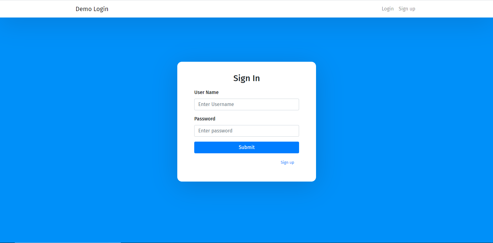
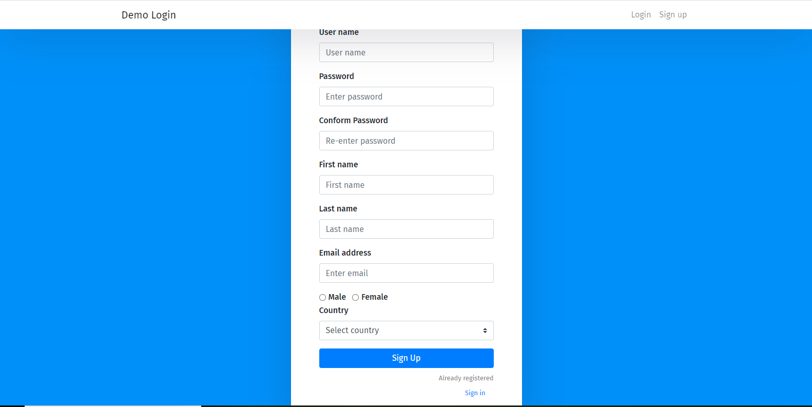
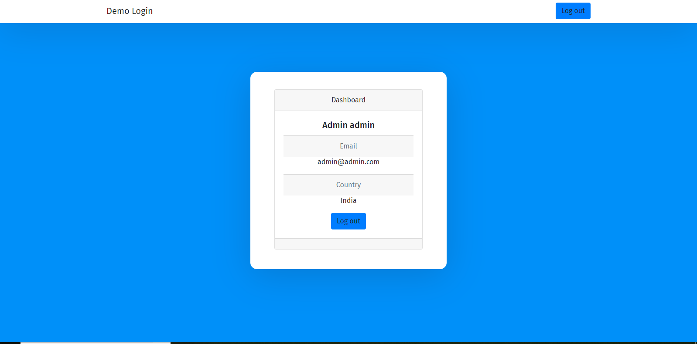
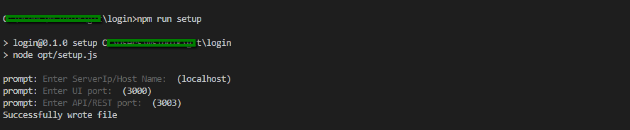

This Login resctjs  was bootstrapped with ReactJs and NodeJs by Mohamed Yasar Arabath(myayasar@gmail.com)

## Available Scripts

In the project directory, you can run:

## Step1

### `npm install`

## Step2

### `npm run setup`

Launches console runner in the interactive watch mode 
to config Server of UI and REST layer listen port

## Step3

### `npm run build`

Builds the app for production to the `build` folder. 
It correctly bundles React in production mode and optimizes the build for the best performance.

The build is minified and the filenames include the hashes. 
Your app is ready to be deployed!

See the section about [deployment](https://facebook.github.io/create-react-app/docs/deployment) for more information.

## Step4

### `npm run serve`

**Note: this is a way of operation for production run and project deployment!**
